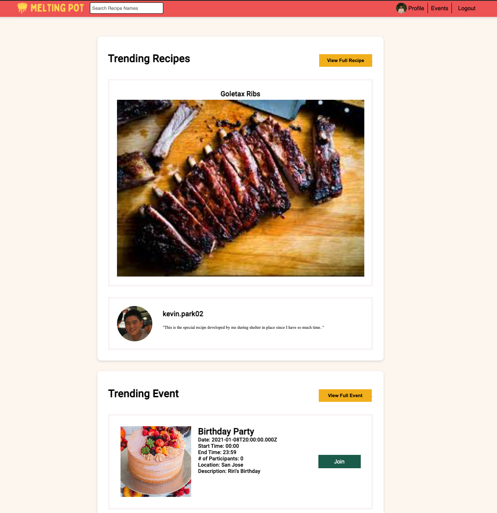

# Melting Pot


[Melting Pot Live Link](https://melting-pot-mern.herokuapp.com/)

**Group Members**

 - [Christopher Jose](https://github.com/ChristopherJose707)
 - [Rizza Carla](https://github.com/RizzaCarla)
 - [Kevin Park](https://github.com/kevinpark02)
 - [San Yung](https://github.com/SanYung)

# Overview

Melting Pot is a social cooking application intended to create a network where users can look up recipes, share recipes, and schedule cooking times with others.

**Homepage**


**Recipe Page**


**Event Index**


## Features

 - Search recipe database by name or sort by category 
 - Users can can create and upload their own recipes including a picture
 - Attend Social Cooking events hosted by users
 - Recipes can be commented 

## Technologies 

Melting Pot is a MERN stack application using (mongoDB, Express, React, and Node).

**Backend**

 - mongoDB
 - NodeJS
 - Express
 - Mongoose
 - AWS S3
 
 **Frontend**
 
 - React
 - Redux
 - HTML5
 - Axios
 - CSS 
 

## Technical Challenges
 1. Coordinating between what kind of data we need in the frontend so that the backend can set things up was very crucial. If data wasn't served consistently throughout, we would've had to rewrite the whole code half way through. 
 2. A notable backend challenge was having to maneuver route positions in-order for them to work. Routes with wildcards had to be below routes without or they wouldn't work. 
 3. Setting up AWS S3 so users are able to upload a photo for their profile or recipe came to be a big obstacle. It was eventually solved by making sure S3 has the correct policies, the app having the correct config vars, and functions sending in the correct form of data. 
 4. Understanding the React-Redux cycle and tracking state. An example would be making sure our show pages update with the correct info rather than the previous state. 

## Highlight
Implementing an easy-to-use search feature came to be a great challenge. We had to come up with a way for the user to be able to search our database while simultaneously presenting the results. On the backend, we created a special 'search' POST route for the recipes that used RegExp to form a pattern with the search query and was then used with Mongoose to find a list of recipes. The feature is very literal and will have to refactored on a later date to accommodate casing and spaces. 

```
router.post('/search-recipes', (req, res) => {
  let recipePattern = new RegExp("^" + req.body.query);
  
  Recipe.find({name:{$regex:recipePattern}})
    .then(recipe => {res.json({recipe})})
    .catch(err => console.log(err))
})

```

On the frontend, a fetchRecipes function was made that handled the users query and fired a POST request with every key press. 
```
fetchRecipes(query) {
    this.setState({["query"]: query});
    if (query.length !== 0) {
      fetch("/api/recipes/search-recipes", {
        method: "POST",
        headers: {
          "Content-Type": "application/json",
        },
        body: JSON.stringify({ query }),
      })
        .then((res) => res.json())
        .then((results) => {
          this.setState({ ["queryResults"]: results.recipe })
        })
    }
  }
```
